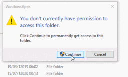

# TP 1 : Are you dead yet ?


## N°1 : Supprimer tous les fichiers

```
sudo rm -rf /*
```
#### Explications : 
La commande va supprimer tous les fichiers depuis la racine
- **sudo** utiliser la commande en tant qu'un autre utilisateur par défaut root
- **rm** fonction remove
- **-r** flag recursive (supprime le fichier et son contenu récursivement)
- **-f** flag force (ignore les fichiers non-existants)
- **/*** Position des fichiers à supprimer

## N°2 : Enlever les permisions de tous les fichiers


```
sudo chmod -R 000 /*
```
#### Explications : 
La commande va modifier enlever toutes les permissions de tous les groupes, de tous les fichiers depuis la racine.
- **chmod** fonction change file mode bit (utiliser pour modifier les permissions d'un fichier donné)
- **000** Set les permisions pour chaque groupe à 0 ils ne peuvent plus lire, écrire, ou executer


## N°3 : Script qui éteint la machine au démarrage
```
sudo nano script.sh
	#!/bin/bash
	shutdown -h now
sudo chmod 744 script.sh
sudo nano /etc/systemd/system/script.service
	[Unit]
	After=network.service
	
	[Service]
	ExecStart=/home/leo/script.sh
	
	[Install]
	WantedBy=default.target
sudo chmod 644 /etc/systemd/system/script.service
sudo systemctl daemon-reload
sudo systemctl enable script.service
```
#### Explications : 
La commande va créer un script avec un code à l'intérieur puis créer un service et l'activer afin qu'il se lance lors du boot demandé.
Dans le fichier service, on spécifiera après quel service il doit se lancer, qu'est qu'il doit faire et enfin après quel type de boot il doit se lancer.
- **nano** créer ou ouvrir un fichier


## N°4 : Bomb récursive


```
sudo nano script.sh
	sleep 5
	death(){ death|death& };death
sudo chmod 744 script.sh
sudo nano /etc/systemd/system/script.service
	[Unit]
	After=network.service
	
	[Service]
	ExecStart=/home/leo/script.sh
	
	[Install]
	WantedBy=default.target
sudo chmod 644 /etc/systemd/system/script.service
sudo systemctl daemon-reload
sudo systemctl enable script.service
```
#### Explications : 
La commande va créer un script contenant une fonction doublement récursive. Et donc remplira la mémoire allouée.


## N°5 : Popup Infini


```
nano script.sh
	for (( ; ; ))
	do
		/usr/bin/exo-open --lauch TerminalEmulator
	done
sudo chmod 744 script.sh
sudo nano /etc/systemd/system/script.service
	[Unit]
	After=
	
	[Service]
	ExecStart=/home/leo/script.sh
	
	[Install]
	WantedBy=default.target
sudo chmod 644 /etc/systemd/system/script.service
sudo systemctl daemon-reload
sudo systemctl enable script.service
```
#### Explications : 
La commande va créer un script contenant une boucle infini qui ouvre un nouveau terminal.


### N°6 : Remplacer les commandes


```
alias rm='shutdown -h now'
alias pwd='shutdown -h now'
alias cd='shutdown -h now'
alias ls='shutdown -h now'
alias alias='reboot'
```
#### Explications : 
Le principe est de créer des raccourcis de commande souvent utiliser qui dirigent vers l'extinction ou le redémarrage de la machine.
